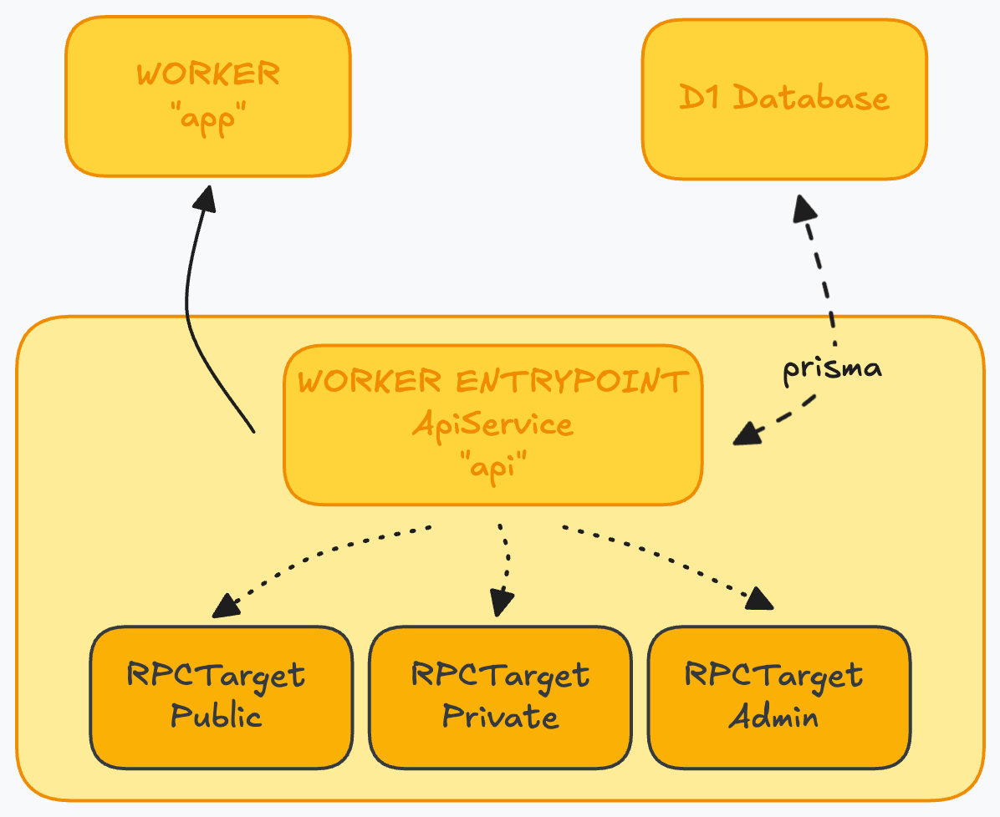

# Worker + D1 + RPC + React Router + Prisma + RPC

[]()

A little POC setup with Vite and TurboRepo to demonstrate a decoupled architecture built with all these great tools.

The goal was to create an Object Capability Model, where instead of passing authentication info / tokens, an implicit capabability or collection of available capabilites is returned.
This provides typesafety, simplifies explicit permission checking, and executing processes that could throw due to lack of permissions.

### Example

Consider an authenticated User with a role of "user" and a functionality of deleting any user from a database for which an "admin" role is expected

A theoretical flow with traditional API/Rest approach would look something this:

```ts
try {
  await fetch('/api/user/123', {
    method: 'DELETE',
    headers: { Authorization: 'Bearer <token>' },
  })
  console.log('User is deleted')
} catch (error) {
  if (error.status === 403)
    console.log('You are not an admin, deleting users is not allowed')
  else console.log('Something else went wrong')
}
```

With Object Capabilities, it could be solved something like this:

```ts
// A user object after authentication, which the API service
// will use to built the capabilities
let user = { name: 'John', role: 'user', id: '...' }

/**
 * Obtain a proper RPC Stub, implicitly representing actions
 * available as per the user's role/permissions/etc.
 * The RPC Stub might look something like this:
 *
 *  {
 *    deleteUser?: (userId: string) => Promise<void>
 *  }
 *
 */
let api = API.authorize(user)

// `deleteUser` method might not be available, it's existence
// in itself denotes the cabability
await api.deleteUser?.('123')
console.log('User is deleted')

// OR we can check for explicit permissions too
if (!api.deleteUser)
  throw new Response('You are not an admin, deleting users is not allowed', {
    status: 403,
  })

await api.deleteUser('123')
console.log('User is deleted')
```

### Gotchas

- A refined version of Prisma Migrate is still in Early Access, and `diff` lacks finegrained support for D1 (eg. when location differs from a local `.wrangler` folder). I'm symlinking the shared root-level `.wrangler` folder now.
- The POC still uses the `prisma-client-js` generator for Prisma Client, which will be replaced by a more modular and "bundler-friendly" `prisma-client` in the next major version. Currently generating such client source code depends on importing the `wasm` query engine from `@prisma/client`, which is improperly resolved by Vite. There are also some improper paths/types generated. Although there might be some workarounds (hacking with `resolve` configs, handwritten custom Vite plugin, etc.), bugs are still expected, as this feature is in Early Access too.
- A custom output path has to be provided for `@prisma/client`, the default destination has Vite resolver issues too, that's why the `@prisma/client-generated` is used. (Currently `output` is optional, but will be required indeed in further Prisma releases.)
